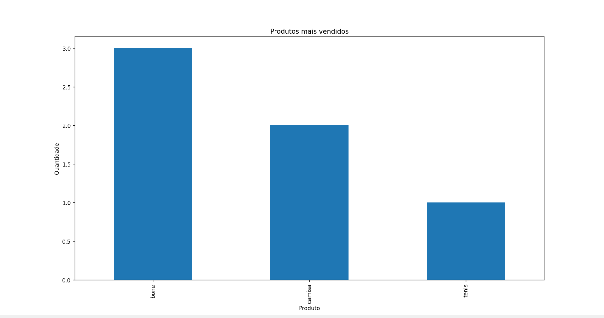

# Análise de Dados de Vendas em Python

Projeto para análise de dados de vendas a partir de arquivos CSV, com geração de métricas e visualizações.

---

## Funcionalidades

* Leitura de dados a partir de arquivo CSV
* Cálculo de faturamento total
* Identificação do produto mais vendido
* Geração de ranking de vendas
* Cálculo de ticket médio
* Criação de gráfico de vendas
* Exportação de relatório em CSV

---

## Tecnologias utilizadas

* Python
* Pandas
* Matplotlib

---

## Estrutura do projeto

```
analise-dados/
 ├── main.py
 ├── data/
 │    ├── vendas.csv
 │    └── relatorio.csv
 └── README.md
```

---

## Como executar

1. Instale as dependências:

```
pip install pandas matplotlib
```

2. Execute o projeto:

```
python main.py
```

3. Informe o caminho do arquivo CSV:

```
data/vendas.csv
```

---

## Exemplo de saída

```
Faturamento total: 390
Produto mais vendido: bone

Ranking de vendas:
bone      3
camisa    2
tenis     1

Ticket médio: 130.0
```

---

## Saída gerada

O sistema cria automaticamente um arquivo:

```
data/relatorio.csv
```
com os dados processados.
## Visualização




